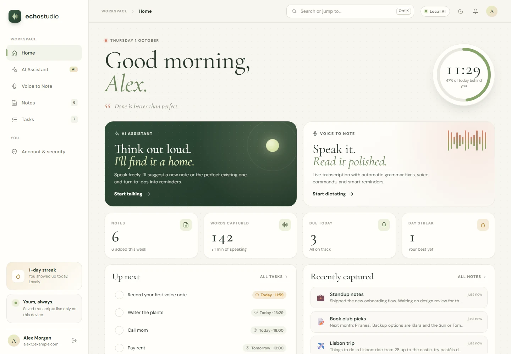
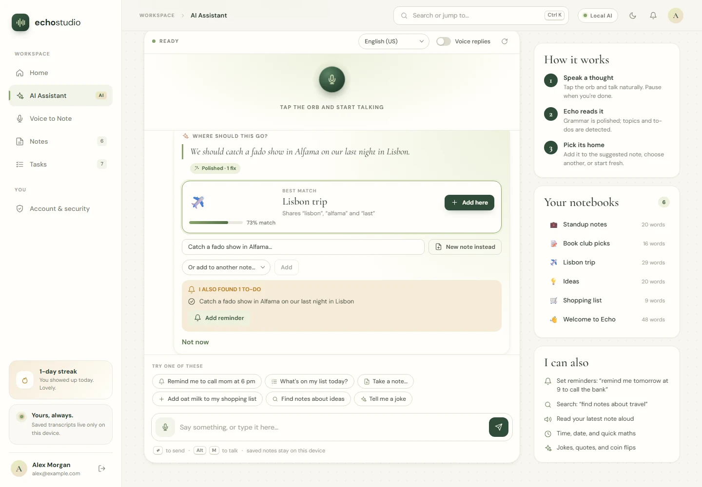
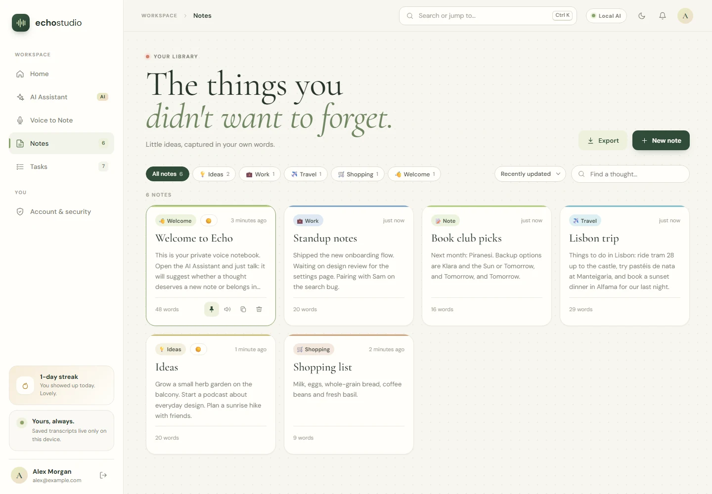
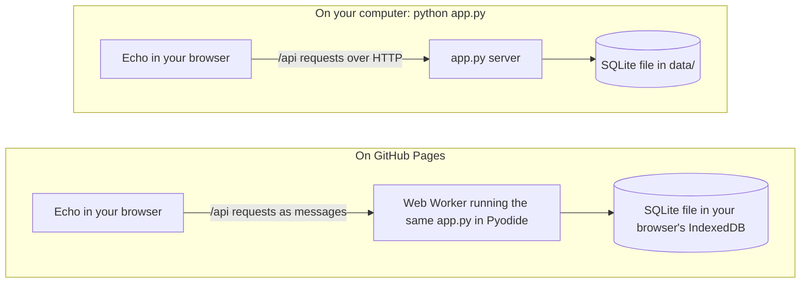

<div align="center">


# Echo Voice Studio

**Think out loud. We'll keep it all.**

A private voice studio: an AI assistant that files your thoughts, dictation with automatic grammar polish,<br>
and reminders that actually remind you. Pure Python on the server, plain JavaScript in the browser.

[**Try it live**](https://deepak17kb.github.io/Echo-Voice-Studio/) · [Run it on your computer](#run-it-on-your-computer) · [How the live version works](#how-the-live-version-works)

[](https://github.com/Deepak17kb/Echo-Voice-Studio/actions/workflows/pages.yml)
[](https://deepak17kb.github.io/Echo-Voice-Studio/)


</div>

<picture>
  <source media="(prefers-color-scheme: dark)" srcset="docs/screenshots/home-dark.webp">
  
</picture>

## Highlights

- **An assistant that files for you.** Say a thought and Echo suggests the note it belongs in, shows why, or offers to start a new one.
- **Dictation that cleans itself up.** Speak freely; punctuation, spelling and run-on sentences are fixed when you stop, with a word-level view of every change.
- **Reminders from plain speech.** "Remind me to call mom at 6 pm" becomes a task with a notification, chime and snooze.
- **Private by design.** Accounts, notes and tasks stay on your computer, or in your browser on the live site.
- **No setup.** Python's standard library only: no `pip install`, Node.js or API key. Claude is optional.

<table>
  <tr>
    <td width="50%">
      <picture>
        <source media="(prefers-color-scheme: dark)" srcset="docs/screenshots/assistant-dark.webp">
        
      </picture>
    </td>
    <td width="50%">
      <picture>
        <source media="(prefers-color-scheme: dark)" srcset="docs/screenshots/notes-dark.webp">
        
      </picture>
    </td>
  </tr>
  <tr>
    <td align="center"><b>AI Assistant:</b> finds the right note and spots to-dos</td>
    <td align="center"><b>Notes:</b> topics, search, pinning and export</td>
  </tr>
</table>

## Try It Live

Open **[deepak17kb.github.io/Echo-Voice-Studio](https://deepak17kb.github.io/Echo-Voice-Studio/)** and choose **Create account**. There's nothing to install.

- **First visit:** your browser downloads Echo's Python engine (about 6 MB), which can take 10 seconds or so. After that it's cached and the studio opens in a few seconds.
- **Your data stays in that browser.** Everything you create is saved on that device only. It isn't uploaded anywhere and doesn't sync between devices or browsers. Clearing the site's data deletes it, so use **Export** on the Notes page to keep a copy.
- **One tab at a time.** A second tab waits until you close the first, so the two never overwrite each other's changes.
- **Voice input** works best in Chrome or Edge. Everything else works in any modern browser.
- **Local engine only.** The live site never uses Claude: that needs an API key, and keys don't belong in a public web page.

## Run It on Your Computer

On Windows, double-click **`run.bat`**. It starts the local server and opens the studio in your browser. Keep its window open while you use Echo; press **Ctrl+C** there to stop.

Or, from this folder:

```powershell
python app.py
```

Then open [http://127.0.0.1:8000](http://127.0.0.1:8000). On macOS or Linux, run `python3 app.py`. Python 3.10 or newer is required. No `pip install`, Node.js, or API key is needed.

The first time, choose **Create account**. Your new studio starts with a few example notes and tasks so there's something to explore.

## What's Inside

**Sign in and accounts.** Register with a name, email and password, then sign in with a remembered session. Every registration, sign-in, sign-out and failed attempt is stored with its time, device and address. You can review this history, and download it as CSV, on the **Account & security** page. Each account's notes and tasks are private to that account.

**AI Assistant.** Tap the orb and talk; Echo stops listening when you pause. Say something worth keeping and it polishes the wording, then recommends a place for it:

- **Add it to the best-matching note.** It shows the match strength and the words both share.
- **Create a new note.** You get a suggested title.
- **Pick any other note** from a list.

It also spots to-dos in what you said and offers to set reminders. You can ask it things directly:

- `Remind me to call mom at 6 pm` sets a reminder.
- `Add oat milk to my shopping list` appends straight to that note, with Undo.
- `What's on my list today?`, `Find notes about travel`, `Read my last note`.
- The time, the date, quick maths, jokes, quotes and coin flips.

**Voice to Note.** Continuous dictation with a live waveform, word count, speaking pace and timer. You can speak punctuation and commands (see below). When you stop recording, the grammar is polished automatically; a word-level view shows exactly what changed, and you can undo it. While you talk, Echo suggests a title, topics and mood. It also flags when the text belongs in an existing note, and lists detected to-dos with their due times. Drafts are kept if you close the tab.

**Tasks and reminders.** Type or say a task with a time in plain language, such as "water the plants in 30 minutes" or "pay rent on Friday at 10". When a task is due, Echo shows a reminder with Done and Snooze, plays a soft chime, and sends a system notification if you allow it. Tasks are grouped into Today, Upcoming, Anytime and Done, with a daily progress ring.

**Notes library.** Filter by topic, sort, search with highlighting, pin favorites, read aloud, copy, and edit in a dialog. You can polish any note, download it as Markdown, or export everything. Deleting a note can be undone.

**Home.** A greeting, a live clock, your stats, a streak counter, a 12-week activity heatmap, topic breakdown, what's up next, recent notes and rotating tips.

**Extras.** A command palette (**Ctrl+K**), keyboard shortcuts (press **?**), light and dark themes with an animated switch, and a mobile layout with a tab bar. Transitions are everywhere, and they respect your system's reduced-motion setting.

## Voice Commands (Voice to Note)

| Say | Does |
| --- | --- |
| "comma", "period", "question mark", "exclamation mark", "colon" | Inserts the punctuation |
| "new line", "new paragraph" | Starts a new line or paragraph |
| "scratch that" | Removes the last phrase |
| "stop listening" | Stops recording |
| "save note" | Stops, polishes, and saves |

Turn these off in the toolbar if you'd rather say the words literally.

## AI Engines

By default everything runs on **Echo's local engine**, in `brain.py`. It is rule-based and deterministic:

- Grammar polish fixes fillers, stutters, common misspellings, missing apostrophes, a/an, run-on sentences, capitals and punctuation. It is conservative and English-focused; other languages get light cleanup only.
- Note matching uses TF-IDF similarity plus shared topics.
- Due-date parsing handles "tomorrow at 5 pm", "in 20 minutes", "on Friday" and similar phrases.
- Assistant intents are recognized from patterns.

**Optional: use Claude** (local app only). Install the official SDK and set an API key before starting Echo:

```powershell
pip install anthropic
$env:ANTHROPIC_API_KEY = "sk-ant-..."
python app.py
```

With a key present, grammar polish and open-ended questions (anything the local engine can't answer, like "what's the capital of France?") go to Claude (`claude-opus-5-5`). Note matching, reminders and everything else stay local. If a Claude request fails for any reason, Echo quietly falls back to the local engine. The badge in the top bar shows which engine is active. Set `ECHO_AI=local` to never use Claude, or `ECHO_AI=claude` to try it with credentials from `ant auth login`.

## How the Live Version Works

GitHub Pages can only host static files, and Echo's server is written in Python. So the live site runs that same Python code inside your browser, using [Pyodide](https://pyodide.org) (Python compiled to WebAssembly):



- `tools/build_static.py` copies the web app and Echo's Python files into a static site.
- In the browser, `web/js/engine-worker.js` starts Pyodide in a Web Worker so the page stays smooth, and `browser_bridge.py` hands each `/api` request to the same request handler the local server uses.
- The database is an ordinary SQLite file, saved in your browser's IndexedDB after every change.
- `.github/workflows/pages.yml` runs the tests on every push and pull request. When `main` changes and the tests pass, it builds the site and publishes it.

The local app never loads any of this, so `python app.py` works exactly as before.

## Deploy Your Own Copy

1. Fork this repository.
2. In your fork, open **Settings → Pages** and set **Source** to **GitHub Actions**. If the **Actions** tab asks, enable workflows.
3. Push a commit to `main`, or run **Test and deploy** from the **Actions** tab. Your copy goes live at `https://<your-username>.github.io/<repository-name>/`.

To preview the static site on your computer first:

```powershell
python tools/build_static.py site
python -m http.server 8080 --directory site
```

Then open [http://127.0.0.1:8080](http://127.0.0.1:8080).

## Privacy and Security

- Echo's server listens only on your own computer (`127.0.0.1`) and ignores requests addressed to any other host name. This blocks DNS-rebinding attacks from websites.
- Accounts, sessions, sign-in history, notes and tasks live in `data/voice_assistant.sqlite3`.
- Passwords are never stored. Echo keeps a salted PBKDF2-SHA256 hash (240,000 iterations), and failed sign-ins are rate-limited.
- Sessions use a random token in an HttpOnly, SameSite=Strict cookie; only a hash of the token is stored. Requests that change data must be JSON, which blocks cross-site form attacks.
- **Microphone transcription uses your browser's speech service**, which may send audio over the internet depending on the browser. Nothing is saved until you save it.
- **If you enable Claude**, the text you ask it to polish is sent to Anthropic's API. So are your open-ended questions, with the last few chat messages and a short summary of your workspace: your first name, the time, note titles and open tasks.
- Otherwise Echo makes no external calls. The optional Google Fonts are loaded by your browser.

**On the live site**, a few things differ:

- Your studio is stored in that browser's IndexedDB. GitHub only serves the app's files and never sees what you type.
- Your browser downloads the Python engine from the jsDelivr CDN, as well as the Google Fonts.
- Passwords are hashed with 100,000 PBKDF2 iterations instead of 240,000, because the hashing runs in pure Python in the browser.
- Signing in protects your studio inside the app, but the data sits unencrypted in the browser's storage, like any website's. Avoid keeping anything sensitive there on a shared computer.

Voice input works best in current Microsoft Edge or Google Chrome. Typing works everywhere. Notifications appear when you allow them; otherwise reminders show inside Echo while it's open.

## Keyboard Shortcuts

| Keys | Action |
| --- | --- |
| Ctrl+K | Search notes, tasks and commands |
| Alt+1 … Alt+6 | Home, Assistant, Voice to Note, Notes, Tasks, Account |
| Alt+M | Talk to the assistant |
| Alt+R | Start or stop dictation |
| Alt+N | New note |
| Alt+T | Toggle dark mode |
| Ctrl+Enter | Save the note you're editing |
| ? | Show all shortcuts |

## Run the Tests

```powershell
python -m unittest -v
```

The suite covers:

- Grammar polish, due-date parsing, to-do extraction, note matching and assistant intents.
- Password hashing, sessions and sign-in history.
- Migration of the original single-user database.
- Privacy between accounts, and the full HTTP API: sign-up, sign-in, rate limiting, notes, tasks, assistant commands and security headers.
- The in-browser bridge behind the live site, and the pure-Python password hashing it relies on.
- The optional Claude path, with a mocked client.
- Consistency between the HTML and the JavaScript that drives it.

Test data is temporary and never touches your saved notes. GitHub Actions runs the suite on every push and pull request, and the live site only updates when it passes.

## Storage and Configuration

- Delete `data/voice_assistant.sqlite3` to remove all accounts, notes and tasks permanently. On the live site, clear the site's data in your browser instead.
- Notes saved by an earlier version of Echo, before accounts existed, belong to the first account you create.
- `PORT` changes the port (default `8000`); `VOICE_ASSISTANT_DB` changes the database path.
- `ECHO_OPEN_BROWSER=1` opens the browser automatically; `run.bat` sets it.
- `ECHO_AI` (`auto`, `local`, `claude`) and `ECHO_CLAUDE_MODEL` control the optional Claude engine.
- The original `Speech Recognition Model Using Python` entry point still starts the studio.

## Project Layout

```text
app.py                       HTTP server: routing, accounts, sessions, JSON API, static files
store.py                     SQLite storage: users, sessions, sign-in history, notes, tasks
brain.py                     Local language engine: polish, matching, to-dos, due dates, assistant
claude_engine.py             Optional Claude polish and chat, with local fallback
browser_bridge.py            Live site: runs the same request handler inside the browser
web/index.html               Sign-in screen, studio shell, all views and dialogs
web/styles.css               Design system: tokens, light and dark themes, motion, responsive layout
web/js/main.js               Boot, sign-in flow, navigation, theme, keyboard shortcuts
web/js/auth.js               Sign in and create-account screen
web/js/home.js               Dashboard: clock, stats, streak, heatmap, topics, tips
web/js/assistant.js          AI assistant: voice orb, chat, and where-to-save suggestions
web/js/dictate.js            Voice to Note: dictation, voice commands, polish, saving
web/js/notes.js              Notes library and note dialog
web/js/tasks.js              Tasks view and natural-language task entry
web/js/notify.js             Reminder scheduling, notifications, chime, and the bell inbox
web/js/account.js            Profile, preferences, and sign-in history
web/js/palette.js            Ctrl+K command palette
web/js/voice.js              Speech recognition, microphone levels, and spoken replies
web/js/ui.js                 Shared DOM, formatting, dialog, and animation helpers
web/js/state.js              Shared state and preferences
web/js/api.js                JSON requests to the local server or the in-browser engine
web/js/router.js             Hash-based navigation
web/js/theme.js              Applies the saved theme before first paint
web/js/browser-backend.js    Live site: sends API requests to the in-browser engine
web/js/engine-worker.js      Live site: Web Worker running Python (Pyodide), saving to IndexedDB
tools/build_static.py        Builds the static site for GitHub Pages
.github/workflows/pages.yml  Tests every push; deploys main to GitHub Pages
docs/screenshots/            Images used in this README
test_app.py                  Dependency-free unit and integration tests
run.bat                      Windows double-click startup
```

## Roadmap

This project began as a small `pyttsx3` script that greeted you and told the time; that first version lives on in the repository history. Here's how far it has come against the original wish list:

- [x] Answer more questions, so it no longer feels like a one-question interview candidate
- [x] Understand people who don't speak like a robot
- [x] AI-based conversation (built in, with optional Claude for open questions)
- [x] Alarms, reminders and task automation, complete with notifications
- [x] Remind the developer to stop debugging at 3:00 a.m. (try “remind me to go to sleep at 3 am”)
- [x] Run it from a link, with nothing to install
- [ ] Weather updates
- [ ] Music playback

## Author

**Deepak ThePac** ([@Deepak17kb](https://github.com/Deepak17kb))
